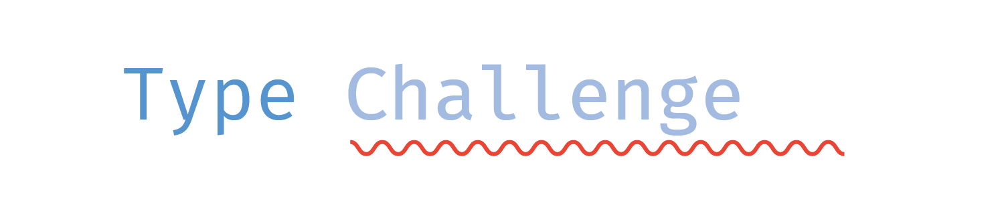

  

<h3 align='center'>Репозиторий с решениями <a href="https://github.com/type-challenges/type-challenges">type-challenges</a></h3>

 

<table>
  <tr>
    <th>№</th>
    <th>Задача</th>
    <th>Тэги</th>
  </tr>

<tr><td>1</td><td><a href="./challenges/00002-medium-return-type/README.md" target="_blank"><strong>Get Return Type</strong></a></td><td>  </td></tr>
<tr><td>2</td><td><a href="./challenges/00003-medium-omit/README.md" target="_blank"><strong>Omit</strong></a></td><td>  </td></tr>
<tr><td>3</td><td><a href="./challenges/00004-easy-pick/README.md" target="_blank"><strong>Pick</strong></a></td><td>  </td></tr>
<tr><td>4</td><td><a href="./challenges/00005-extreme-readonly-keys/README.md" target="_blank"><strong>Get Readonly Keys</strong></a></td><td>  </td></tr>
<tr><td>5</td><td><a href="./challenges/00007-easy-readonly/README.md" target="_blank"><strong>Readonly</strong></a></td><td>   </td></tr>
<tr><td>6</td><td><a href="./challenges/00008-medium-readonly-2/README.md" target="_blank"><strong>Readonly 2</strong></a></td><td>  </td></tr>
<tr><td>7</td><td><a href="./challenges/00009-medium-deep-readonly/README.md" target="_blank"><strong>Deep Readonly</strong></a></td><td>   </td></tr>
<tr><td>8</td><td><a href="./challenges/00010-medium-tuple-to-union/README.md" target="_blank"><strong>Tuple to Union</strong></a></td><td>   </td></tr>
<tr><td>9</td><td><a href="./challenges/00011-easy-tuple-to-object/README.md" target="_blank"><strong>Tuple to Object</strong></a></td><td> </td></tr>
<tr><td>10</td><td><a href="./challenges/00012-medium-chainable-options/README.md" target="_blank"><strong>Chainable Options</strong></a></td><td> </td></tr>
<tr><td>11</td><td><a href="./challenges/00013-warm-hello-world/README.md" target="_blank"><strong>Hello World</strong></a></td><td></td></tr>
<tr><td>12</td><td><a href="./challenges/00014-easy-first/README.md" target="_blank"><strong>First of Array</strong></a></td><td> </td></tr>
<tr><td>13</td><td><a href="./challenges/00015-medium-last/README.md" target="_blank"><strong>Last of Array</strong></a></td><td> </td></tr>
<tr><td>14</td><td><a href="./challenges/00016-medium-pop/README.md" target="_blank"><strong>Pop</strong></a></td><td> </td></tr>
<tr><td>15</td><td><a href="./challenges/00017-hard-currying-1/README.md" target="_blank"><strong>Currying 1</strong></a></td><td> </td></tr>
<tr><td>16</td><td><a href="./challenges/00018-easy-tuple-length/README.md" target="_blank"><strong>Length of Tuple</strong></a></td><td> </td></tr>
<tr><td>17</td><td><a href="./challenges/00043-easy-exclude/README.md" target="_blank"><strong>Exclude</strong></a></td><td>  </td></tr>
<tr><td>18</td><td><a href="./challenges/00055-hard-union-to-intersection/README.md" target="_blank"><strong>Union to Intersection</strong></a></td><td>  </td></tr>
<tr><td>19</td><td><a href="./challenges/00057-hard-get-required/README.md" target="_blank"><strong>Get Required</strong></a></td><td>  </td></tr>
<tr><td>20</td><td><a href="./challenges/00059-hard-get-optional/README.md" target="_blank"><strong>Get Optional</strong></a></td><td>  </td></tr>
<tr><td>21</td><td><a href="./challenges/00062-medium-type-lookup/README.md" target="_blank"><strong>Type Lookup</strong></a></td><td>  </td></tr>
<tr><td>22</td><td><a href="./challenges/00089-hard-required-keys/README.md" target="_blank"><strong>Required Keys</strong></a></td><td> </td></tr>
<tr><td>23</td><td><a href="./challenges/00090-hard-optional-keys/README.md" target="_blank"><strong>Optional Keys</strong></a></td><td> </td></tr>
<tr><td>24</td><td><a href="./challenges/00106-medium-trimleft/README.md" target="_blank"><strong>Trim Left</strong></a></td><td> </td></tr>
<tr><td>25</td><td><a href="./challenges/00108-medium-trim/README.md" target="_blank"><strong>Trim</strong></a></td><td> </td></tr>
<tr><td>26</td><td><a href="./challenges/00110-medium-capitalize/README.md" target="_blank"><strong>Capitalize</strong></a></td><td> </td></tr>
<tr><td>27</td><td><a href="./challenges/00112-hard-capitalizewords/README.md" target="_blank"><strong>Capitalize Words</strong></a></td><td> </td></tr>
<tr><td>28</td><td><a href="./challenges/00114-hard-camelcase/README.md" target="_blank"><strong>CamelCase</strong></a></td><td> </td></tr>
<tr><td>29</td><td><a href="./challenges/00116-medium-replace/README.md" target="_blank"><strong>Replace</strong></a></td><td> </td></tr>
<tr><td>30</td><td><a href="./challenges/00119-medium-replaceall/README.md" target="_blank"><strong>ReplaceAll</strong></a></td><td> </td></tr>
<tr><td>31</td><td><a href="./challenges/00147-hard-c-printf-parser/README.md" target="_blank"><strong>C-printf Parser</strong></a></td><td> </td></tr>
<tr><td>32</td><td><a href="./challenges/00151-extreme-query-string-parser/README.md" target="_blank"><strong>Query String Parser</strong></a></td><td> </td></tr>
<tr><td>33</td><td><a href="./challenges/00189-easy-awaited/README.md" target="_blank"><strong>Awaited</strong></a></td><td>  </td></tr>
<tr><td>34</td><td><a href="./challenges/00191-medium-append-argument/README.md" target="_blank"><strong>Append Argument</strong></a></td><td> </td></tr>
<tr><td>35</td><td><a href="./challenges/00216-extreme-slice/README.md" target="_blank"><strong>Slice</strong></a></td><td> </td></tr>
<tr><td>36</td><td><a href="./challenges/00223-hard-isany/README.md" target="_blank"><strong>IsAny</strong></a></td><td> </td></tr>
<tr><td>37</td><td><a href="./challenges/00268-easy-if/README.md" target="_blank"><strong>If</strong></a></td><td> </td></tr>
<tr><td>38</td><td><a href="./challenges/00270-hard-typed-get/README.md" target="_blank"><strong>Typed Get</strong></a></td><td>  </td></tr>
<tr><td>39</td><td><a href="./challenges/00274-extreme-integers-comparator/README.md" target="_blank"><strong>Integers Comparator</strong></a></td><td>  </td></tr>
<tr><td>40</td><td><a href="./challenges/00296-medium-permutation/README.md" target="_blank"><strong>Permutation</strong></a></td><td> </td></tr>
<tr><td>41</td><td><a href="./challenges/00298-medium-length-of-string/README.md" target="_blank"><strong>Length of String</strong></a></td><td> </td></tr>
<tr><td>42</td><td><a href="./challenges/00300-hard-string-to-number/README.md" target="_blank"><strong>String to Number</strong></a></td><td> </td></tr>
<tr><td>43</td><td><a href="./challenges/00399-hard-tuple-filter/README.md" target="_blank"><strong>Tuple Filter</strong></a></td><td>  </td></tr>
<tr><td>44</td><td><a href="./challenges/00459-medium-flatten/README.md" target="_blank"><strong>Flatten</strong></a></td><td> </td></tr>
<tr><td>45</td><td><a href="./challenges/00472-hard-tuple-to-enum-object/README.md" target="_blank"><strong>Tuple to Enum Object</strong></a></td><td>  </td></tr>
<tr><td>46</td><td><a href="./challenges/00527-medium-append-to-object/README.md" target="_blank"><strong>Append to object</strong></a></td><td> </td></tr>
<tr><td>47</td><td><a href="./challenges/00529-medium-absolute/README.md" target="_blank"><strong>Absolute</strong></a></td><td>  </td></tr>
<tr><td>48</td><td><a href="./challenges/00531-medium-string-to-union/README.md" target="_blank"><strong>String to Union</strong></a></td><td>  </td></tr>
<tr><td>49</td><td><a href="./challenges/00533-easy-concat/README.md" target="_blank"><strong>Concat</strong></a></td><td> </td></tr>
<tr><td>50</td><td><a href="./challenges/00545-hard-printf/README.md" target="_blank"><strong>printf</strong></a></td><td> </td></tr>
<tr><td>51</td><td><a href="./challenges/00553-hard-deep-object-to-unique/README.md" target="_blank"><strong>Deep object to unique</strong></a></td><td> </td></tr>
<tr><td>52</td><td><a href="./challenges/00599-medium-merge/README.md" target="_blank"><strong>Merge</strong></a></td><td> </td></tr>
<tr><td>53</td><td><a href="./challenges/00612-medium-kebabcase/README.md" target="_blank"><strong>KebabCase</strong></a></td><td> </td></tr>
<tr><td>54</td><td><a href="./challenges/00645-medium-diff/README.md" target="_blank"><strong>Diff</strong></a></td><td> </td></tr>
<tr><td>55</td><td><a href="./challenges/00651-hard-length-of-string-2/README.md" target="_blank"><strong>Length of String 2</strong></a></td><td> </td></tr>
<tr><td>56</td><td><a href="./challenges/00730-hard-union-to-tuple/README.md" target="_blank"><strong>Union to Tuple</strong></a></td><td>   </td></tr>
<tr><td>57</td><td><a href="./challenges/00847-hard-string-join/README.md" target="_blank"><strong>String Join</strong></a></td><td></td></tr>
<tr><td>58</td><td><a href="./challenges/00898-easy-includes/README.md" target="_blank"><strong>Includes</strong></a></td><td> </td></tr>
<tr><td>59</td><td><a href="./challenges/00949-medium-anyof/README.md" target="_blank"><strong>AnyOf</strong></a></td><td> </td></tr>
<tr><td>60</td><td><a href="./challenges/00956-hard-deeppick/README.md" target="_blank"><strong>DeepPick</strong></a></td><td> </td></tr>
<tr><td>61</td><td><a href="./challenges/01042-medium-isnever/README.md" target="_blank"><strong>IsNever</strong></a></td><td>  </td></tr>
<tr><td>62</td><td><a href="./challenges/01097-medium-isunion/README.md" target="_blank"><strong>IsUnion</strong></a></td><td> </td></tr>
<tr><td>63</td><td><a href="./challenges/01130-medium-replacekeys/README.md" target="_blank"><strong>ReplaceKeys</strong></a></td><td> </td></tr>
<tr><td>64</td><td><a href="./challenges/01367-medium-remove-index-signature/README.md" target="_blank"><strong>Remove Index Signature</strong></a></td><td> </td></tr>
<tr><td>65</td><td><a href="./challenges/01383-hard-camelize/README.md" target="_blank"><strong>Camelize</strong></a></td><td>  </td></tr>
<tr><td>66</td><td><a href="./challenges/01978-medium-percentage-parser/README.md" target="_blank"><strong>Percentage Parser</strong></a></td><td> </td></tr>
<tr><td>67</td><td><a href="./challenges/02059-hard-drop-string/README.md" target="_blank"><strong>Drop String</strong></a></td><td>  </td></tr>
<tr><td>68</td><td><a href="./challenges/02070-medium-drop-char/README.md" target="_blank"><strong>Drop Char</strong></a></td><td>  </td></tr>
<tr><td>69</td><td><a href="./challenges/02257-medium-minusone/README.md" target="_blank"><strong>MinusOne</strong></a></td><td> </td></tr>
<tr><td>70</td><td><a href="./challenges/02595-medium-pickbytype/README.md" target="_blank"><strong>PickByType</strong></a></td><td> </td></tr>
<tr><td>71</td><td><a href="./challenges/02688-medium-startswith/README.md" target="_blank"><strong>StartsWith</strong></a></td><td> </td></tr>
<tr><td>72</td><td><a href="./challenges/02693-medium-endswith/README.md" target="_blank"><strong>EndsWith</strong></a></td><td> </td></tr>
<tr><td>73</td><td><a href="./challenges/02757-medium-partialbykeys/README.md" target="_blank"><strong>PartialByKeys</strong></a></td><td> </td></tr>
<tr><td>74</td><td><a href="./challenges/02759-medium-requiredbykeys/README.md" target="_blank"><strong>RequiredByKeys</strong></a></td><td> </td></tr>
<tr><td>75</td><td><a href="./challenges/02793-medium-mutable/README.md" target="_blank"><strong>Mutable</strong></a></td><td>  </td></tr>
<tr><td>76</td><td><a href="./challenges/02822-hard-split/README.md" target="_blank"><strong>Split</strong></a></td><td>    </td></tr>
<tr><td>77</td><td><a href="./challenges/02852-medium-omitbytype/README.md" target="_blank"><strong>OmitByType</strong></a></td><td> </td></tr>
<tr><td>78</td><td><a href="./challenges/02857-hard-isrequiredkey/README.md" target="_blank"><strong>IsRequiredKey</strong></a></td><td> </td></tr>
<tr><td>79</td><td><a href="./challenges/02946-medium-objectentries/README.md" target="_blank"><strong>ObjectEntries</strong></a></td><td> </td></tr>
<tr><td>80</td><td><a href="./challenges/02949-hard-objectfromentries/README.md" target="_blank"><strong>ObjectFromEntries</strong></a></td><td> </td></tr>
<tr><td>81</td><td><a href="./challenges/03057-easy-push/README.md" target="_blank"><strong>Push</strong></a></td><td> </td></tr>
<tr><td>82</td><td><a href="./challenges/03060-easy-unshift/README.md" target="_blank"><strong>Unshift</strong></a></td><td> </td></tr>
<tr><td>83</td><td><a href="./challenges/03062-medium-shift/README.md" target="_blank"><strong>Shift</strong></a></td><td> </td></tr>
<tr><td>84</td><td><a href="./challenges/03188-medium-tuple-to-nested-object/README.md" target="_blank"><strong>Tuple to Nested Object</strong></a></td><td>  </td></tr>
<tr><td>85</td><td><a href="./challenges/03192-medium-reverse/README.md" target="_blank"><strong>Reverse</strong></a></td><td> </td></tr>
<tr><td>86</td><td><a href="./challenges/03196-medium-flip-arguments/README.md" target="_blank"><strong>Flip Arguments</strong></a></td><td> </td></tr>
<tr><td>87</td><td><a href="./challenges/03243-medium-flattendepth/README.md" target="_blank"><strong>FlattenDepth</strong></a></td><td> </td></tr>
<tr><td>88</td><td><a href="./challenges/03312-easy-parameters/README.md" target="_blank"><strong>Parameters</strong></a></td><td>   </td></tr>
<tr><td>89</td><td><a href="./challenges/03326-medium-bem-style-string/README.md" target="_blank"><strong>BEM style string</strong></a></td><td>   </td></tr>
<tr><td>90</td><td><a href="./challenges/03376-medium-inordertraversal/README.md" target="_blank"><strong>InorderTraversal</strong></a></td><td> </td></tr>
<tr><td>91</td><td><a href="./challenges/04037-hard-ispalindrome/README.md" target="_blank"><strong>IsPalindrome</strong></a></td><td> </td></tr>
<tr><td>92</td><td><a href="./challenges/04179-medium-flip/README.md" target="_blank"><strong>Flip</strong></a></td><td> </td></tr>
<tr><td>93</td><td><a href="./challenges/04182-medium-fibonacci-sequence/README.md" target="_blank"><strong>Fibonacci Sequence</strong></a></td><td></td></tr>
<tr><td>94</td><td><a href="./challenges/04260-medium-nomiwase/README.md" target="_blank"><strong>AllCombinations</strong></a></td><td>   </td></tr>
<tr><td>95</td><td><a href="./challenges/04425-medium-greater-than/README.md" target="_blank"><strong>Greater Than</strong></a></td><td> </td></tr>
<tr><td>96</td><td><a href="./challenges/04471-medium-zip/README.md" target="_blank"><strong>Zip</strong></a></td><td> </td></tr>
<tr><td>97</td><td><a href="./challenges/04484-medium-istuple/README.md" target="_blank"><strong>IsTuple</strong></a></td><td> </td></tr>
<tr><td>98</td><td><a href="./challenges/04499-medium-chunk/README.md" target="_blank"><strong>Chunk</strong></a></td><td> </td></tr>
<tr><td>99</td><td><a href="./challenges/04518-medium-fill/README.md" target="_blank"><strong>Fill</strong></a></td><td> </td></tr>
<tr><td>100</td><td><a href="./challenges/04803-medium-trim-right/README.md" target="_blank"><strong>Trim Right</strong></a></td><td> </td></tr>
<tr><td>101</td><td><a href="./challenges/05117-medium-without/README.md" target="_blank"><strong>Without</strong></a></td><td>  </td></tr>
<tr><td>102</td><td><a href="./challenges/05140-medium-trunc/README.md" target="_blank"><strong>Trunc</strong></a></td><td> </td></tr>
<tr><td>103</td><td><a href="./challenges/05153-medium-indexof/README.md" target="_blank"><strong>IndexOf</strong></a></td><td> </td></tr>
<tr><td>104</td><td><a href="./challenges/05181-hard-mutable-keys/README.md" target="_blank"><strong>Mutable Keys</strong></a></td><td> </td></tr>
<tr><td>105</td><td><a href="./challenges/05310-medium-join/README.md" target="_blank"><strong>Join</strong></a></td><td> </td></tr>
<tr><td>106</td><td><a href="./challenges/05317-medium-lastindexof/README.md" target="_blank"><strong>LastIndexOf</strong></a></td><td> </td></tr>
<tr><td>107</td><td><a href="./challenges/05360-medium-unique/README.md" target="_blank"><strong>Unique</strong></a></td><td> </td></tr>
<tr><td>108</td><td><a href="./challenges/05423-hard-intersection/README.md" target="_blank"><strong>Intersection</strong></a></td><td>  </td></tr>
<tr><td>109</td><td><a href="./challenges/05821-medium-maptypes/README.md" target="_blank"><strong>MapTypes</strong></a></td><td>   </td></tr>
<tr><td>110</td><td><a href="./challenges/06141-hard-binary-to-decimal/README.md" target="_blank"><strong>Binary to Decimal</strong></a></td><td> </td></tr>
<tr><td>111</td><td><a href="./challenges/07258-hard-object-key-paths/README.md" target="_blank"><strong>Object Key Paths</strong></a></td><td> </td></tr>
<tr><td>112</td><td><a href="./challenges/07544-medium-construct-tuple/README.md" target="_blank"><strong>Construct Tuple</strong></a></td><td> </td></tr>
<tr><td>113</td><td><a href="./challenges/08640-medium-number-range/README.md" target="_blank"><strong>Number Range</strong></a></td><td></td></tr>
<tr><td>114</td><td><a href="./challenges/08767-medium-combination/README.md" target="_blank"><strong>Combination</strong></a></td><td>   </td></tr>
<tr><td>115</td><td><a href="./challenges/08804-hard-two-sum/README.md" target="_blank"><strong>Two Sum</strong></a></td><td>  </td></tr>
<tr><td>116</td><td><a href="./challenges/08987-medium-subsequence/README.md" target="_blank"><strong>Subsequence</strong></a></td><td> </td></tr>
<tr><td>117</td><td><a href="./challenges/09142-medium-checkrepeatedchars/README.md" target="_blank"><strong>CheckRepeatedChars</strong></a></td><td>  </td></tr>
<tr><td>118</td><td><a href="./challenges/09155-hard-validdate/README.md" target="_blank"><strong>ValidDate</strong></a></td><td></td></tr>
<tr><td>119</td><td><a href="./challenges/09160-hard-assign/README.md" target="_blank"><strong>Assign</strong></a></td><td>  </td></tr>
<tr><td>120</td><td><a href="./challenges/09286-medium-firstuniquecharindex/README.md" target="_blank"><strong>FirstUniqueCharIndex</strong></a></td><td> </td></tr>
<tr><td>121</td><td><a href="./challenges/09384-hard-maximum/README.md" target="_blank"><strong>Maximum</strong></a></td><td> </td></tr>
<tr><td>122</td><td><a href="./challenges/09775-hard-capitalize-nest-object-keys/README.md" target="_blank"><strong>Capitalize Nest Object Keys</strong></a></td><td>  </td></tr>
<tr><td>123</td><td><a href="./challenges/09896-medium-get-middle-element/README.md" target="_blank"><strong>GetMiddleElement</strong></a></td><td></td></tr>
<tr><td>124</td><td><a href="./challenges/09898-medium-zhao-chu-mu-biao-shu-zu-zhong-zhi-chu-xian-guo-yi-ci-de-yuan-su/README.md" target="_blank"><strong>Appear only once</strong></a></td><td></td></tr>
<tr><td>125</td><td><a href="./challenges/10969-medium-integer/README.md" target="_blank"><strong>Integer</strong></a></td><td> </td></tr>
<tr><td>126</td><td><a href="./challenges/13580-hard-replace-union/README.md" target="_blank"><strong>Replace Union</strong></a></td><td></td></tr>
<tr><td>127</td><td><a href="./challenges/14080-hard-fizzbuzz/README.md" target="_blank"><strong>FizzBuzz</strong></a></td><td>   </td></tr>
<tr><td>128</td><td><a href="./challenges/14188-hard-run-length-encoding/README.md" target="_blank"><strong>Run-length encoding</strong></a></td><td></td></tr>
<tr><td>129</td><td><a href="./challenges/15260-hard-tree-path-array/README.md" target="_blank"><strong>Tree path array</strong></a></td><td></td></tr>
<tr><td>130</td><td><a href="./challenges/16259-medium-to-primitive/README.md" target="_blank"><strong>ToPrimitive</strong></a></td><td></td></tr>
<tr><td>131</td><td><a href="./challenges/17973-medium-deepmutable/README.md" target="_blank"><strong>DeepMutable</strong></a></td><td>  </td></tr>
<tr><td>132</td><td><a href="./challenges/18142-medium-all/README.md" target="_blank"><strong>All</strong></a></td><td> </td></tr>
<tr><td>133</td><td><a href="./challenges/18220-medium-filter/README.md" target="_blank"><strong>Filter</strong></a></td><td>  </td></tr>
<tr><td>134</td><td><a href="./challenges/19458-hard-snakecase/README.md" target="_blank"><strong>SnakeCase</strong></a></td><td>  </td></tr>
<tr><td>135</td><td><a href="./challenges/21106-medium-zu-he-jian-lei-xing-combination-key-type/README.md" target="_blank"><strong>Combination key type</strong></a></td><td></td></tr>
<tr><td>136</td><td><a href="./challenges/25170-medium-replace-first/README.md" target="_blank"><strong>Replace First</strong></a></td><td></td></tr>
<tr><td>137</td><td><a href="./challenges/25270-medium-transpose/README.md" target="_blank"><strong>Transpose</strong></a></td><td>  </td></tr>
<tr><td>138</td><td><a href="./challenges/25747-hard-isnegativenumber/README.md" target="_blank"><strong>IsNegativeNumber</strong></a></td><td>  </td></tr>
<tr><td>139</td><td><a href="./challenges/26401-medium-json-schema-to-typescript/README.md" target="_blank"><strong>JSON Schema to TypeScript</strong></a></td><td> </td></tr>

</table>
